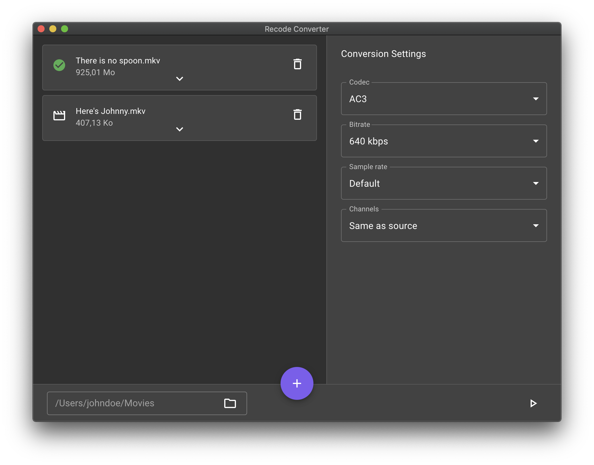

<div align="center">
  
  <h1>Audio Converter</h1>
  <strong>A modern & simple audio converter for video files</strong>
  
</div>

## Development

### Requirements

The application is built with Electron and React and is using FFMPEG. Make sure to have Node.js, Yarn & FFMPEG installed.

### Installation

1. Clone this repository: `git clone https://github.com/sunshine0709/audio-converter.git`
2. Navigate into the project directory: `cd audio-converter`
3. Install dependencies: `yarn`

### Run the app

```
yarn dev
```

### Building the app

- **for all supported OS**
```
yarn electron-pack:all
```
- **macOS**
```
yarn electron-pack:mac
```
- **Windows**
```
yarn electron-pack:win
```
- **Linux**
```
yarn electron-pack:linux
```
- **all OS**
```
yarn electron-pack
```
